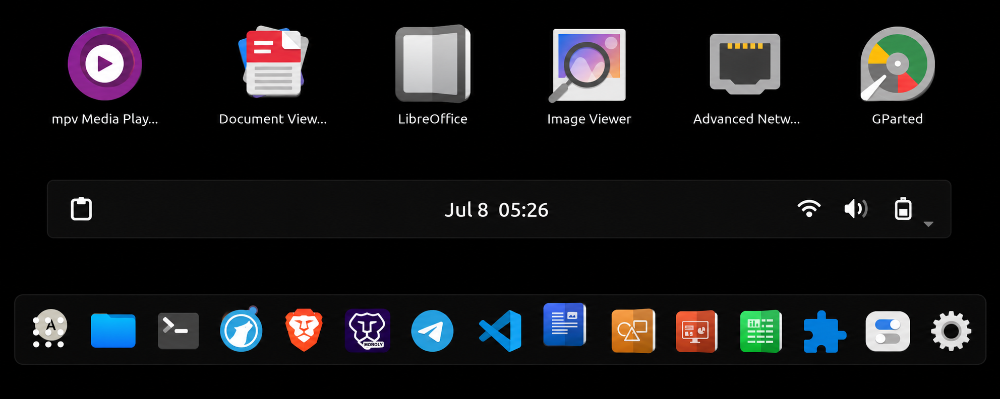

# Papiwaita Icon Theme

A custom icon theme combining Papirus-Dark app icons with Adwaita symbolic system icons and Kora folder and file manager icons for GNOME.

## Preview

## Features
- App icons from Papirus-Dark
- System tray icons from Adwaita (battery, WiFi, volume etc)
- Folder icons from Kora
- File manager icons from Kora
- LibreOffice icons from Kora
- Lightweight and minimal
- Perfect for GNOME dark setups

## Installation
1. Make sure Papirus-Dark is installed: `sudo apt install papirus-icon-theme`
2. Clone this repo: `git clone git@github.com:mimisco-git/Papiwaita.git`
3. Copy to icons folder: `cp -r Papiwaita ~/.local/share/icons/`
4. Open GNOME Tweaks, Appearance, Icons and select Papiwaita

## Credits
- App icons: Papirus Development Team
- System icons: GNOME Adwaita Team
- Folder and file manager icons: Kora by bikass
- Combined by: mimisco-git
